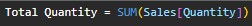
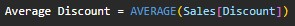
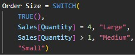
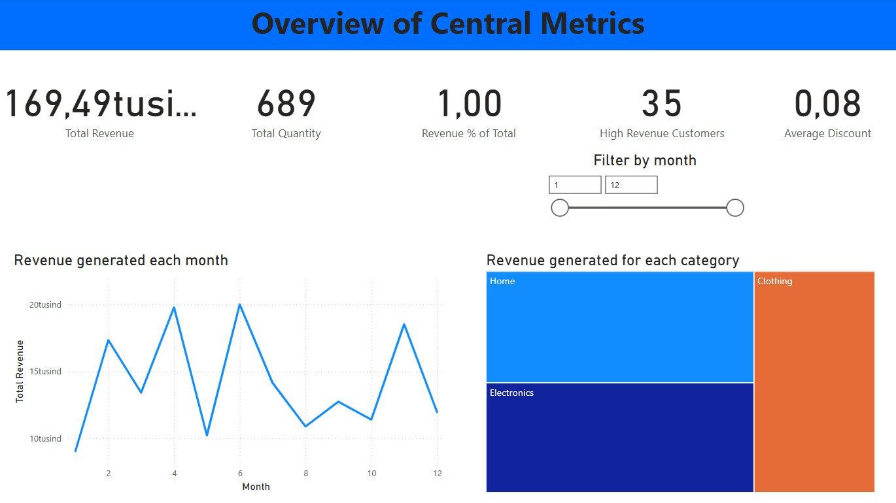
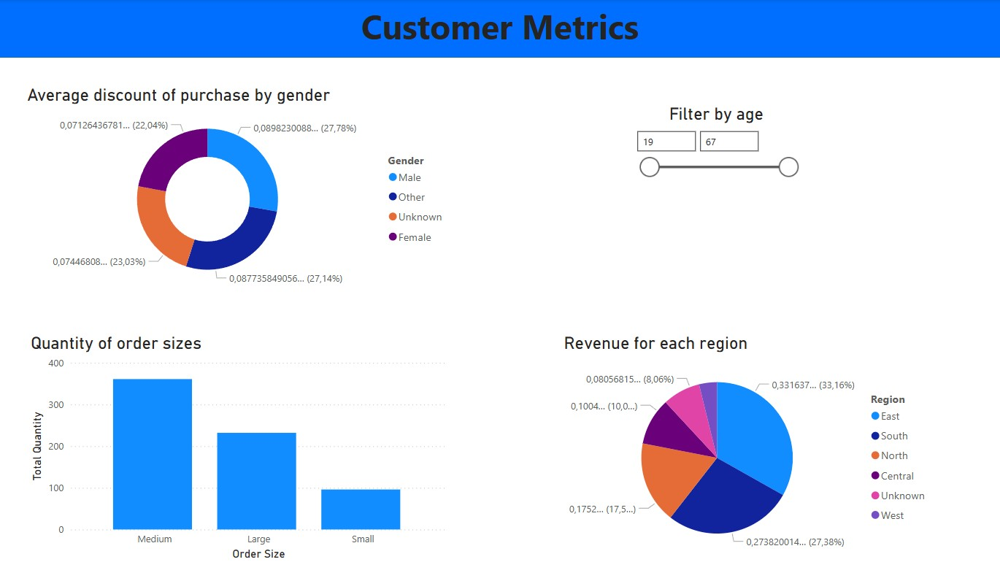

# Power_BI_Star_Schema_Webshop
A Power BI project, using artificial webshop data to create a star schema model and report.

## Quick Links
- Artificial Webshop Dataset: [Artifical Webshop Dataset](artificial_webshop_data.xlsx)
- Power BI project file: [Project File](Webshop_star_schema_project.pbix)
- Other projects I have made: [Portfolio Website](https://lucashoffschmidt.github.io/)

## Technologies Used
- **Excel**: Importing the dataset.
- **Power BI**: Power Query cleaning, modeling and report creation.

## Process
**Import**
- Imported tables from excel

**Power Query**
- Converted data types of columns 
- Substituted N/A and null values 
- Trimmed text columns
- Standardized terms
- Used first row as header 
- Rounded values

**Modeling**
- Created many to one relationships between fact table and dimensional tables
- Hid all ID columns from the report view
- Set date table as universal date table
- Created DAX measures of sales data

- Create a calculated order size column based on quantity purchased by the customer

**Reporting**
- Made an overview page with cards of metrics, a line chart of revenue generated each month and a treemap of revenue generated for each category with drilldown functionality.
- Made a products page with bar charts of revenue by product and quantity by product and a matrix showing metrics by category with drilldown functionality.
- Made a customers page with a column chart showing quantity order sizes, circle chart for revenue by region and a donut chart for the average discount of purchase by gender.
- Made slicers to filter by month, age and subcategory.
- Added tooltips to visuals to extend the information shown on hover. 
- Styled and orchestrated visuals for accessibility. 

## Final Report
**Overview of Central Metrics**

**Product Metrics**

**Customer Metrics**

